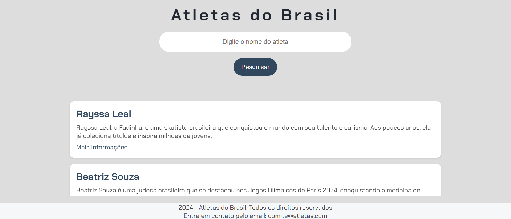

  <h1>Dev Immersion with Gemini</h1>

 

  

 

  

 

 <a href="#theproject">The Project</a> •
 <a href="#howitworks">How it works?</a> •
 <a href="#technologies">Technologies</a> •
 <a href="#route">Route</a> •
 <a href="#howtouse">How to Use</a>

 

<h2> 📓 The Project </h2>

 For sports enthusiasts seeking comprehensive information about their favorite athletes or sports, this application serves as an invaluable resource. It offers a swift and user-friendly means of accessing detailed data.

 

<h2> 💡 How it works? </h2>
<ol>
  <li>
    <strong>Input and search:</strong> Enter the desired athlete or sport into the designated search field.
  </li>
  <li>
    <strong>Data retrieval:</strong> The application conducts a comprehensive search of its extensive database (housed within the dados.js file) to identify pertinent information aligning with your query.
  </li>
  <li>
    <strong>Output generation:</strong> Upon successful retrieval, the application generates a concise summary, including the athlete's name, a brief description, and a link for additional details. In the absence of matching data, a corresponding message is presented to the user.
  </li>
</ol>

 

<h2> 🛠 Technologies </h2>
The following tools were used in building the project:  

|       Tools       |                    Description                    |              References               |
|:-----------------:|:-----------------------------------------------:|:-------------------------------------:|
|      VS CODE      |                       IDE                          |    https://code.visualstudio.com/     |
|       HTML        |   Underpins the webpage's structure, defining elements such as headings, buttons, and result display areas |    https://developer.mozilla.org/en-US/docs/Web/HTML     |
|       CSS         |   Enhances the aesthetic appeal and layout of the webpage through the application of styles, including color schemes and typography |    https://developer.mozilla.org/en-US/docs/Web/CSS     |
|    JavaScript     |   Serves as the application's programming logic, executing search functions, comparing data, and dynamically updating the user interface |    https://developer.mozilla.org/en-US/docs/Web/CSS     |

 

  <h3>Frontend</h3>
  
  
  
   
  <h3>IDE</h3>
  
   

 

<h2> 🔎 Route </h2>
  <ol>
    <li &nbsp;>Part 1 - Starting the project with HTML and CSS | Class 01</li>
     
    <li &nbsp;>Part 2 - Styling the project with CSS | Class 02</li>
     
    <li &nbsp;>Part 3 - Creating the database using JavaScript | Class 03</li>
     
    <li &nbsp;>Part 4 - Implementing the search functionality | Class 04</li>
     
    <li &nbsp;>Part 5 - Completing the project with GitHub and deployment | Class 05</li>
     
  </ol>

<h2>🧪 How to use</h2>
  <ol &nbsp;>
    <li &nbsp;>Set the development environment at you local computer</li>
    <li &nbsp;>Clone the repository 
      <ul>
        <li>git clone https://github.com/alexandrecpedro/immersion-alura-gemini</li>
      </ul>
    </li>
    <li &nbsp;>Enter the project directory: 
      <ul>
        <li>cd immersion-alura-gemini</li>
      </ul>
    </li>
    <li &nbsp;>Run the project: 
      <ul>
        <li>
          <strong>Accessing the application:</strong> Navigate to the index.html file and open it using your chosen web browser.
        </li>
        <li>
          <strong>Initiating a search:</strong> Input the desired athlete or sport into the designated search field to commence a query.
        </li>
      </ul>
    </li>
  </ol>

